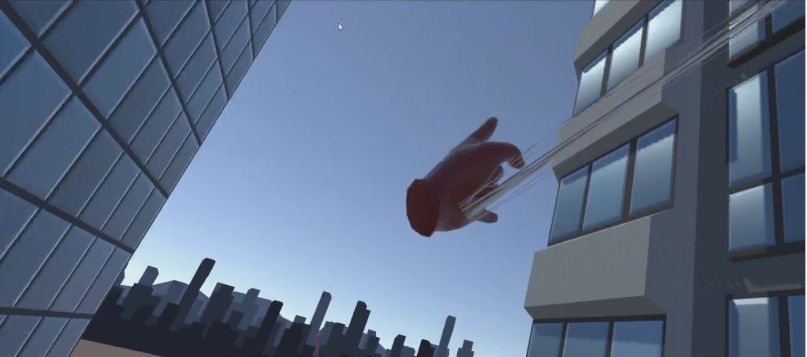
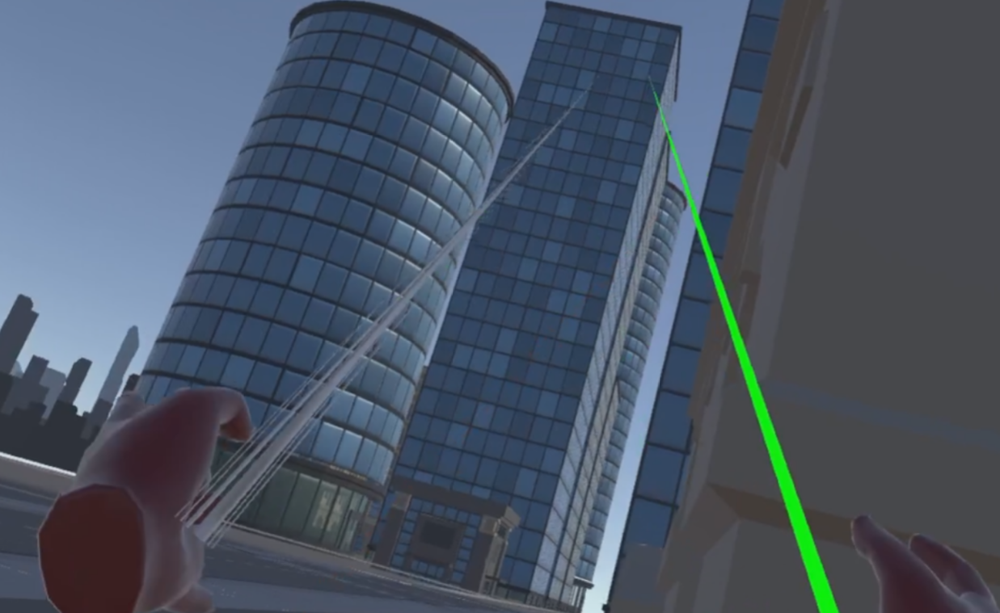
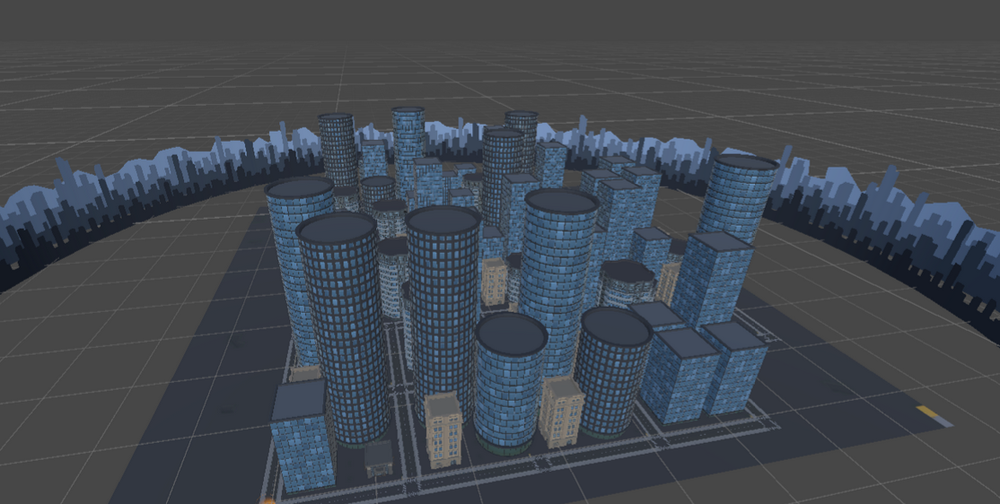

<h1 align="center"> Spiderman game in VR </h1>

  
  
  
  

A game made in a team for our VR workshop in CNAM-ENJMIN using XR Interaction Toolkit and
Meta quest 2 headsets.

- - - - - - - - - - - - - - - - - - - - - - - - - - - - - - - -
For this game we realised : 
- A fluid VR player controller where you can shoot webs with your hands in any direction, pull yourself with the webs
- A race systems with waypoints you need to go to troughout the map
- Multiple feedbacks with the controller and audio cues
  
- - - - - - - - - - - - - - - - - - - - - - - - - - - - - - - -

XR Interaction Toolkit:
https://docs.unity3d.com/Packages/com.unity.xr.interaction.toolkit@2.5/manual/index.html

XR Device Simulator:
https://medium.com/@victormct/create-test-you-vr-projects-without-needing-a-physical-vt-headset-in-unity-ae2545431e0e